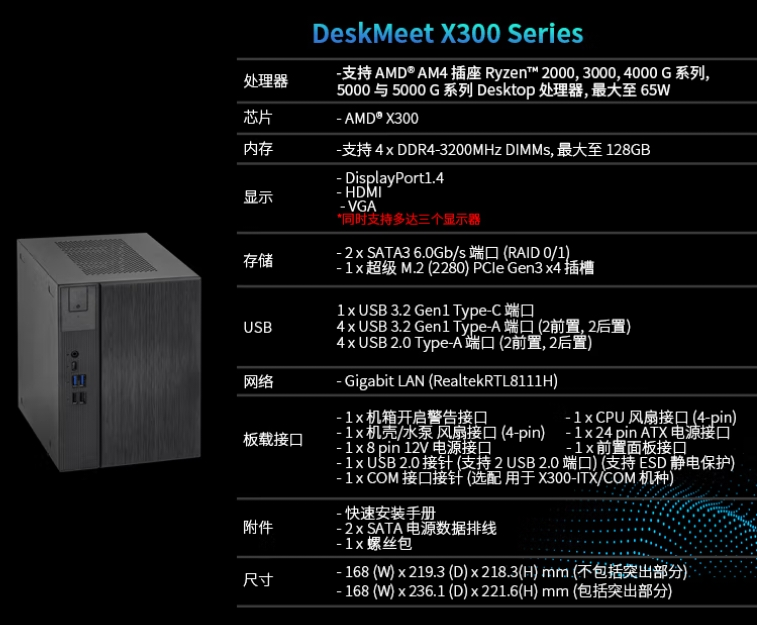

## 配置

机箱/主板：DeskMeet（DeskMini）
CPU：5700G  8核16线程（5600G）
散热：ID-COOLDING 120 一体式水冷
固态：三星 970 Evo Plus 1T
内存：英睿达 16G 3200 D4
显卡：无
电源：Deskmeet 自带

### Deskmeet X300

### 其他参考

cpu：5950x  
主板：asus x570-pro  
内存：海盗船 16g ddr4 3000  
固态：海盗船 1T mp600  
显卡： 无  
电源： 矿龙 1250

## 准系统

1. DeskMini
2. DeskMeet
3. Miniforum

## 系统

- [虚拟机系统](虚拟机系统.md)

- unRaid

## 文章

1. 网络环境
	https://github.com/soulteary/Home-Network-Note

2. 他人的折腾笔记
	- https://soulteary.com/2021/07/02/cheap-home-workstation-solution-part-one.html
	- https://soulteary.com/2021/10/23/amd-5800u-notebook-toss-proxmox-ve-7-0-virtualization.html

3. PVE all in one 群辉 爱快 openwrt
	- https://post.smzdm.com/p/a4dm98ok/
	- https://post.smzdm.com/p/ar6v6ovx/